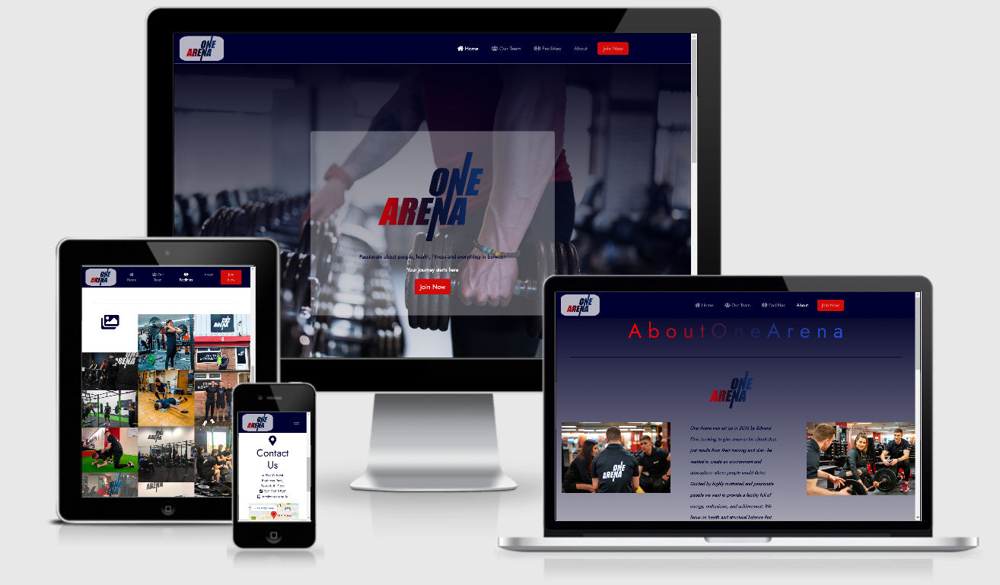

---

# Index

* Project Definition 
* UX 
* Features 
* Technologies Used 
* Testing 
* Deployment 
* Credits

---

# One Arena Gym

This project is based on an actual Gym called One Arena. The goal in building the website is to attract new members and to showcase the gym's 
facilites by way of photos, timetables and introducing the user to each of One Arena's Personal Trainers. 

In keeping with the logo, the style and tone of the website is based around the colour
code the owner chose himself, and I used those colours to best create an online space unique yet familiar to One Arena and it's memebers.

_This is for educational purposes only._

## UX 

### Who is this website for? 

This website is primarily for new memebers who are looking for a local gym but one that has a professional feel to it and a 'straight to the point' attitude.

It also caters to current memebers.
### User Stories 

People who are looking to join a gym but are unsure of which gym might be best.

They might like to:

- *Be introduced to the personal trainers.*
- *See some of the memebers in action (photos etc)*
- *Hear some of the feedback from previous or exsisting memebers.*
- *See if the Gym is also present on social media sites (facebook, instagram, etc)*
- *Check out the timetable and pick a time that best suits them.*
- *Join the Gym via the 'join now' and 'sign up' buttons.*

The website provides:

- *A link to all social media platforms One Arena has.*
- *A contact email address where potenial memebers can open a more formal dialogue.*
- *A Gallery of photos to have a more indepth look into the gym and it's memebers.*
- *A google maps map to facilitate users in easily finding the gym.*
- *A timetable of all available classes.*

## Website Wireframes

### Website pages
    
* All **Wireframes** were originally drawn on paper when I was first designing the 
    website. I wanted to get my ideas into fruition as fast as
    possible and wasn't competent with the sofware.
     The Wireframes below are a copy of those images using [Balsamiq](https://balsamiq.com/).
   
 * [Home](assets/wireframes/Home.png)

    - [Home mobile](assets/wireframes/indexpage.png)

 * [OurTeam](assets/wireframes/OT.png)

    - [OurTeam mobile](assets/wireframes/OurTeam.png)

 * [Facilities](assets/wireframes/Facilities.png)

    - [Facilities mobile](assets/wireframes/Fmobile.png)

 *  [About](assets/wireframes/AboutM.png)

    - [About mobile](assets/wireframes/Aboutpage.png)

 * [Sign Up](assets/wireframes/SignUp.png)

    - [Sign up mobile](assets/wireframes/Signup.png)

*  [Open button on all mobile](assets/wireframes/allbuttons.png)
 

## Features

### Exsisting Features

- **Navigation bar:** allows access to the most relevant pages and content on the website - with a very straight forward approach.

- **Home page:**  looks for the user to join upon seeing the page - has memeber comments and an introduction the team at One Arena.

- **Footer:**   provides the user with contact information, location and email address. The Gym's social media platforms are also present at the click of a button.

- **Sign Up page:** this is the overall goal of the website, to get new memebers and have them sign up with ease on the site.

- **Our Team page:** gives the users a more thorough look at each personal trainer and their background.

- **Facilites page:** provides the user with the a time table for each of the classes and a Gallery so the user can have a window into what it's like at One Arena.

- **About page:** tells the user how One Arena began.

## Technologies Used 

###  Languages 

- <a href="https://en.wikipedia.org/wiki/HTML5"  target="_blank">**HTML/HTML5**</a>
  - **HTML/HTML5** the language used to create the form and add content to the website.

- <a href="https://en.wikipedia.org/wiki/Cascading_Style_Sheets"  target="_blank">**CSS/CSS3**</a>
  - **CSS/CSS3** to provide the styles for the website.

- <a href="https://getbootstrap.com/" target="_blank">**BootStrap 4**</a>
  - I decided to use **Bootstrap's grid** container system as I wanted to design my project with a 'mobile first' approach.

- <a href="https://www.gitpod.io/"  target="_blank">**Gitpod**</a>
  - The project used the **Gitpod** IDE to develop the website.

- <a href="https://github.com/" target="_blank">**GitHub**</a>
  - **GitHub** was used as a hosting service to save the project in a repository.

- <a href="https://imgur.com/" target="_blank">**Imgur**</a>
  - **Imgur** service to host and access images online.

- <a href="https://validator.w3.org/" target="_blank">**W3C validator**</a>
   - **W3C validator** was a great tool throughout the project to test my HTML and CSS code.

###  Other Tools 

- <a href="https://fontawesome.com/" rel="noopener" target="_blank">**Font Awesome**</a>
  - I used **Font Awesome** to add vector icons to the project.

- <a href="http://patorjk.com/text-color-fader/" target="_blank">**Text Colour Fader**</a>
   - I used **Text Color Fader** to more quickly create the various colouring I needed for each letter

 - <a href="https://www.microsoft.com/en-us/p/paint-3d/9nblggh5fv99?activetab=pivot:overviewtab" target="_blank"> **Paint 3D**</a>
   - I used **Paint 3D** for the changing of letter colours in photos to compliment the theme of the page.

## Testing 

### Testing User Stories

1. Be introduced to the personal trainers.
    
    1. Go to Home page.
    2. Scroll down until you see the peronal trainers.
    3. Click 'Read More' below the trainer you want to know more about.

2. See some of the memebers in action (photos etc)

    1. Go to Home page.
    2. Looking at the Nav-bar, click the 'Facilites' page.
    3. Scroll down to the 'Gallery' section.

3. Hear some of the feedback from previous or exsisting memebers.

    1. Go to Home page.
    2. Scroll down.
    3. Stop at 'What Our Members Say' section.

4.  See if the Gym is also present on social media sites (facebook, instagram, etc)

    1. Start from any page.
    2. Scroll down to the very end.
    3. Under the 'Social' section, click on the social media icon you would like to visit.
    
5. Check out the timetable and pick a time that best suits them.

    1. Go to Home page.
    2. Looking at the Nav-bar, click the 'Facilites' page.
    3. Scroll down until you see 'Classes' section and choose a time.

 6. Join the Gym via the 'join now' and 'sign up' buttons.

    1.  Start from any page.
    2. Looking at the Nav-bar, click on the red 'join now button'
    3. Enter your details and click 'Sign Up' button. 

### Testint HTML, CSS and the site

* I used https://validator.w3.org/ to test each page and the CSS.

* I used the 'Audit' option in Google Dev Tools to make sure the site was running efficiently.

* I sent the live link to friends and family members to see if it was mobile ready
    and changed any error one of the users or myself found.

* I tested the site on Google Chrome, FireFox and Internet Explorer.
    Unfortunaly, the site wasn't compatible with Internet Explorer as BootStrap
    isn't supported on it.

* Finally, I used Google Dev Tools to make sure the site was compatible on all the 
    devices listed in their library.
## Deployment 

I created my project on **GitHub** and used **GitPod's** development environment to write my code.

To make my project viewable to others, I deployed my project to **GitHub Pages** with the following process:

    1. I first created the repository inside of my GitHub account using the template given to us by Code Institute.
    2. From there, I launched the project on Gitpod from the repository named *MS1-OneArena*, using Gitpod's Chrome extension.
    3. I pushed all relevant and significant changes to the repository(*MS1-OneArena*), from Gitpod regularly as I worked on it day to day.
    4. Once the project was complete, I opened the 'Settings' section of my project repository in GitHub.
    5. From there, I scrolled to the 'GitHub Pages' section of the 'Settings' page.
    6. Here I selected 'master branch' as my Source.
    7. This deployed my project on GitHub Pages and allowed me to share the live website with others.

 For more information, this process can be found by clicking the following link:<a href="https://help.github.com/en/github/working-with-github-pages/configuring-a-publishing-source-for-your-github-pages-site"> Configuring a publishing source for your GitHub Pages site </a>

## Credits 

 ### Content 

 This project was entirely written by myself Cian O'Connor but also with the aid of:

 * Code Institute's videos - epecially the mini Whiskey and Love Running projects.

 * Youtube - with regards to adding the Carousel and Google maps

 * W3schools - which helped me with small increments throughout the project

 * BootStrap - for the layout of the site and it's mobile first approach.

 ### Media

 Almost all of the images were supplied by OneArena themseleves, appart form a select few.

 Below are the references of those images:

 * Home page:
    - <a href="https://time.com/5795492/gym-fitness-studio-coronavirus/"> Background hero Image</a>

* OurTeam and Facilites page:
    - <a href="https://dnyuz.com/2019/09/01/labor-day-2019-which-gyms-are-open-planet-fitness-la-fitness-golds-gym-anytime-fitness-opening-hours/">Background image Sign up</a>

## Acknowledgements

 * Firstly, I would like to thank OneArena for letting me use their content,
  especially the owner **Edward Finn** - thank you!

* Secondly, I would like to thank my mentor **Antonija Simic**, who really helped with the styling of 
    the site and gave me some invaluable tips which I will carry with me throughout my career.

* Finally, I want to thank my family and partner for their support each day, and for taking an interest
    in my journey as a developer. I am very gratful. Thank you.

<a href="#top">Back to top</a>